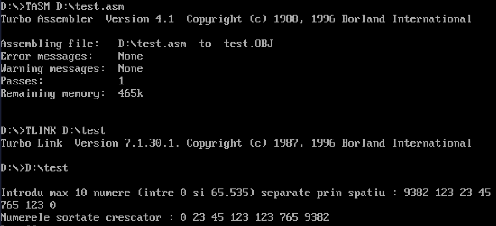

# MASM Array Sorter



**Technologies:** MASM / TASM, DOS interrupts, VS Code DOSBox Extension  
**Language:** Assembly (x86 16-bit)

---

## 🧠 Overview

This project is a small **8086 Assembly program** that runs in a DOS environment.  
It reads up to **10 unsigned integers (0–65,535)** from keyboard input, validates them, sorts them in ascending order, and prints the results on screen.

It was built using **MASM/TASM syntax** and tested in **VS Code** with a DOSBox extension — showing how to handle manual input parsing, memory management, and sorting at the register level.

---

##🧾 Why It’s in My Portfolio

Even though this project is small, it highlights the core skills behind low-level programming:
Manual parsing and algorithm implementation
Understanding of CPU registers and memory addressing
Comfort with legacy tools and environments
Appreciation of how high-level abstractions are built from scratch

---

## ⚙️ Features

- Reads up to **10 integers** separated by spaces  
- Validates input (rejects non-digits and invalid characters)  
- Handles values between **0 and 65,535**  
- Stores numbers in a **word vector** (`DW 10 DUP(0)`)  
- Sorts in ascending order using comparison and `XCHG` swap  
- Prints sorted numbers using a **manual division-by-10 routine**  
- Displays messages for valid and invalid input  

---

## 🧩 Technical Concepts Demonstrated

- **.MODEL SMALL** / segmented memory model usage  
- **DOS interrupts (INT 21h)** for input/output  
  - AH=09h → print string  
  - AH=0Ah → read buffered input  
  - AH=02h → print character  
  - AH=4Ch → exit program  
- Parsing ASCII to numeric with subtraction and multiplication  
- Working with **SI/DI pointers** and `DW` elements  
- Manual **bubble-sort-like algorithm**  
- Stack-based integer-to-string conversion  

---

## 🖥️ How It Works (Step-by-Step)

1. **Prompt User Input**  
   Displays:  
    Introdu max 10 numere (intre 0 si 65.535) separate prin spatiu :

2. **Read Input Line**  
Uses `INT 21h / AH = 0Ah` to store typed data in a buffer.

3. **Parse & Validate**  
- Accepts only digits and spaces  
- Converts ASCII digits into numeric values in `AX`  
- Stores each completed number into `Vector`

4. **Sort Numbers**  
- Compares pairs using nested loops  
- Swaps elements via `XCHG` if out of order

5. **Display Sorted Vector**  
- Each number is divided by 10 repeatedly  
- Remainders are pushed and popped to print digits  
- Spaces separate the numbers visually  

Example run:
Introdu max 10 numere (intre 0 si 65.535) separate prin spatiu :
10 3 25 7
Numerele sortate crescator : 3 7 10 25

---

## 🛠️ Build & Run Instructions

### Requirements
- **MASM or TASM** assembler  
- **DOSBox** (or VS Code with MASM/TASM DOSBox extension)  

### Compile & Link (inside DOSBox)

```bat
masm src\ArraySort.asm;
link ArraySort.obj;
ArraySort.exe

